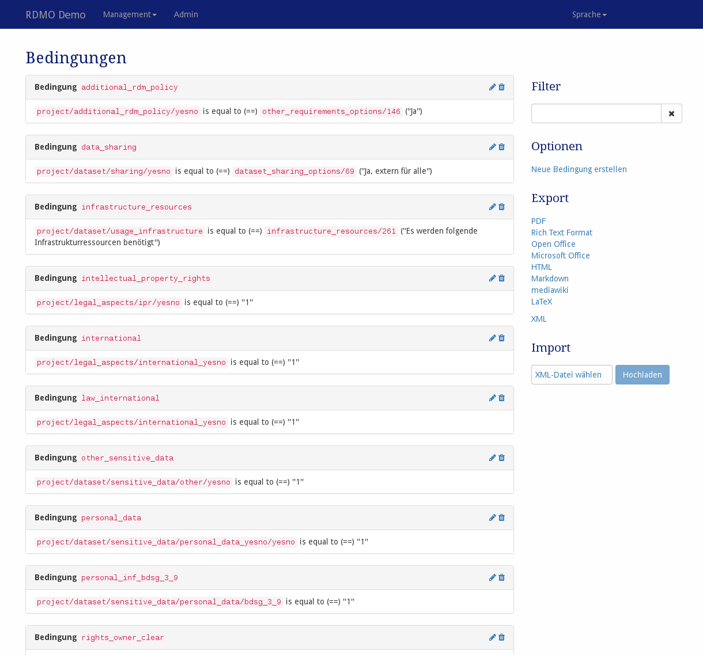

# Bedingungen

Bedingungen können erstellt und bearbeitet werden. Wählen Sie *Bedingungen* im Mangamentmenü der Navigationsleiste. Die Bedingungen werden in einem anderen Schritt mit Entitäten, Attributen, Optionensets oder Aufgaben verbunden.

> *Screenshot des Bedinungen-Managment Interfaces.*

Auf der linken Seite sind alle Bedingungen der RDMO-Installation verfügbar. Für jede Bedingung wird ihr Schlüssel und eine textuelle Darstellung angezeigt. Auf der rechten Seite von jedem Bedingungsfeld zeigen Symbole an wie mit dem jeweiligen Element interagiert werden kann. Die folgenden Optionen stehen zur Auswahl:

* **Bearbeiten** () der Eigenschaften einer Bedingung.
* **Löschen** () einer Bedingung. **Diese Handlung kann nicht rückgängig gemacht werden!**

In der rechten Sidebar gibt es weitere Interface-Optionen:

**Filter** erlaubt eine Suche nach einem vom Benutzer gegebenen Strings. Nur Bedingungen, die diesen String enthalten, werden angezeigt.

**Optionen** bietet weitere Optionen:

  * **Neue Bedingung erstellen**

  * **Export** exportiert die Bedigungen in eines der angezeigten Formate. Während die Textformate hauptschächlich für die Darstellung sind, können XML Ausgaben für den Transfer von Bedingungen zu anderen RDMO Installationen genutzt werden.

Bedingungen haben unterschiedliche Eigenschaften, um ihr Verhalten zu kontrollieren. Wie in [in der Einleitung](../../index.html) beschrieben, haben alle Elemente einen URI-Präfix, einen Schlüssel und einen internen Kommentar, die nur von den anderen Managern der RDMO Installation gesehen werden können. Es können folgende Parameter verändert werden:

## Configuration

Bedingungen sind mit einem Quellen-Attribut, das ausgewertet wird, einer Beziehung wie "gleich" oder "größer als" und einem Ziel ausgestattet. Beispielsweise habe eine Quelle das Attribut `project\legal_aspects/ipr/yesno`, die Beziehung "gleich" und das Ziel "1", dann wird die Bedingung für ein Projekt als wahr ausgewertet werden, wenn die Antwort zu der Frage verbunden mit dem Attribut `project/legal_aspects/ipr/yesno` "1" ist (oder "ja" für ein Ja-Nein Widget).

## Parameter

|Name|Beschreibung|
|-|-|
|Quelle|Das Attribut der Bedingung wird ausgewertet|
|Beziehung|Die Beziehung dieser Kondition, die verwendet wird|
|Ziel (Text)|Falls eine reguläres Attribut verwendet wird, wird der Textwert dieses Attributs geprüft|
|Ziel (Option)|Falls ein Optionsattribut verwendet wird, wird die Option der Bedingung geprüft|
