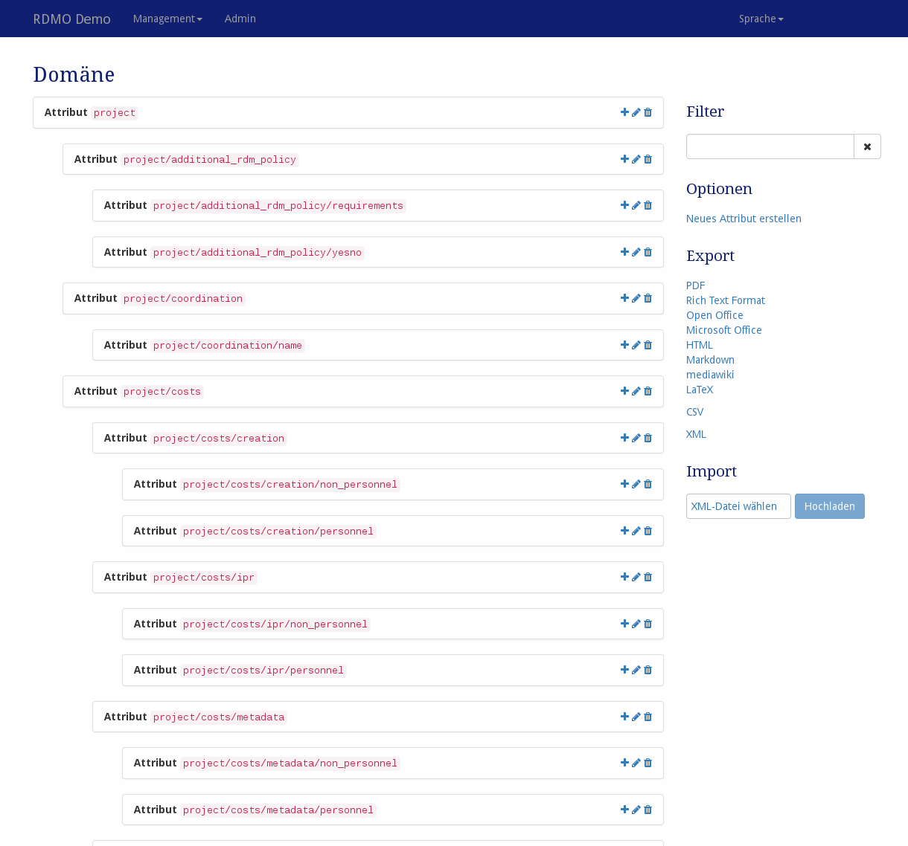

Domäne
------

Das Domänenmodel kann unter *Domäne* im Managementmenü in der Navigationsleiste verändert werden.

Nach der Installation von RDMO ist die Domäne zunächst leer. **Wir empfehlen allen Betreibern von RDMO initial die vom Projekt erarbeitete Domäne zu importieren.**. Die Nutzung einer einheitlichen Domäne über alle RDMO Instanzen ermöglicht den Austausch von Fragenkatalogen, Ansichten und anderem Inhalt und kann perspektivisch zu einem einheitlichen Metadata Application Profile für die Planung des Datenmanagements führen. Die entsprechende XML-Datei ist unter https://github.com/rdmorganiser/rdmo-catalog verfügbar. Sie können die Domäne gerne nach Ihren Wünschen erweitern. Bedenken Sie aber, dass sie der Startpunkt für das Erstellen von Fragenkatalogen sein sollte und die Grundlage der Interoperabilität und Kooperativität verschiedener RDMO-Instanzen ist.

   Screenshot vom Domain-Management Interface.

Es werden alle Attribute der RDMO-Installation gezeigt. Auf der rechten Seite eines jeden Elementfeldes gibt es Icons mit folgender Bedeutung:

* **Hinzufügen** (|add|) eines neuen Attributes zum gewählten Attribut.
* **Bearbeiten** (|update|) eines Attributes, um seine Eigenschaften zu ändern.
* **Entfernen** (|delete|) eines Attributes und all ihrer abhängigen Attribute **Diese Aktion kann nicht rückgängig gemacht werden!**

.. |add| image:: ../_static/img/icons/add.png
.. |update| image:: ../_static/img/icons/update.png
.. |verbosename| image:: ../_static/img/icons/verbosename.png
.. |range| image:: ../_static/img/icons/range.png
.. |conditions| image:: ../_static/img/icons/conditions.png
.. |optionsets| image:: ../_static/img/icons/optionsets.png
.. |delete| image:: ../_static/img/icons/delete.png

Die Sidebar auf der rechten Seite zeigt weitere Bedienelemente:

* **Filter** filtert die Ansicht anhand eines vom Benutzer eingegebenen Strings. Nur Elemente, die diese Zeichenkette in ihrem Pfad enthalten, werden gezeigt.
* **Optionen** bietet weitere Operationen:

  * Neues (leeres) Attribute erstellen

* **Export** exportiert den aktuellen Katalog zu einem der angezeigten Formate. Während Textformate vor allem für die Darstellung gedacht sind, kann der XML Export genutzt werden, um das Domainmodel zu einer anderen RDMO-Installtion zu transferieren.

Die verschiedenen Elemente eines Domänenmodels haben unterschiedliche Eigenschaften, die ihr spezifisches Verhalten bestimmen. Wie in :doc:`der Einleitung <index>` beschrieben, haben alle Elemente einen URI-Präfix, einen Schlüssel und einen internen Kommentar, welche nur von dem Manager der RDMO-Installation gesehen werden kann. Außerdem können folgende Parameter verändert werden:

Attribute
"""""""""

Übergeordnetes Attribut
  Gibt an welches Attribut im Domänenmodell über dem vorliegenden steht.
