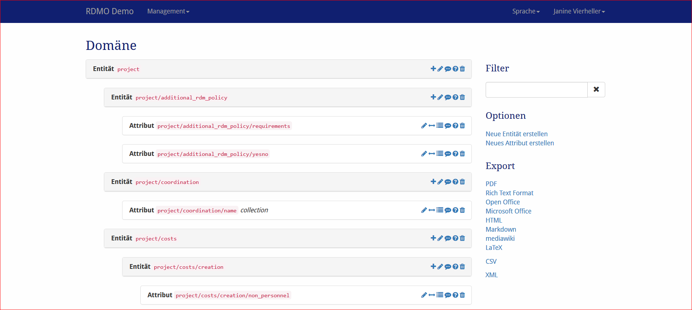

Domäne
------

Das Domänenmodel kann unter *Domäne* im Managementmenü in der Navigationsleiste konfiguriert werden.

   Screenshot vom Domain-Management Interface.

Auf der Seite können alle Entitäten und Attribute der RDMO-Installation gesehen werden. Die Attribute und Entitäten zeigen ihren Pfad und ob sie als Kollektion angelegt worden sind. Auf der rechten Seite eines jeden Elementfeldes gibt es Icons mit folgender Bedeutung:

* **Hinzufügen** (|add|) eines neuen Attributes oder einer Entität zu dieser Entität.
* **Update** (|update|) eines Attributes oder einer Entität, um ihre Eigenschaften zu ändern.an entity or attribute to change its properties.
* **Bereich bearbeiten** (|range|) eines Attributes. Der Wertebereich wird nur benötigt, wenn das Attribut mit einer Frage verknüpft ist, die eine Auswahl, Radio Button oder Check box widget verwendet. 
* **Optionenset bearbeiten** (|optionsets|) eines Attributes. Optionensets bestimmen die Auswahl, wenn das Attribut mit einer Frage verknüpft ist, die eine Auswahl, Radio Button oder Check box widget verwendet. Die Optionensets selbst können unter :doc:` Optionenmangament <options>` konfiguriert werden.
* **Anzeigename bearbeiten** (|verbosename|) eines Attributes oder einer Entität. Für eine Entität wird der Anzeigenahme für den Benutzer sichtbar, wenn Sets einer Frage hinzugefügt werden (anstatt "Set hinzufügen", z.B. "Datensatz hinzufügen"), während für Attribute der Anzeigenahme für den Benutzer sichtbar wird, wenn ein Item der Frage mit mehreren Antworten hinzugefügt wird (anstatt "Item hinzufügen", z.B. "Stichwort hinzufügen").
* **Bedingung hinzufügen** (|conditions|) eines Attributes oder einer Entität. Eine Frage, die mit einem Attribut mit einer oder mehreren Bedingungen verknüpft ist, wird automatisch im Fragenkatalog übersprungen, wenn die Bedingung als falsch ausgewertet wurde. Das Gleiche gilt für Fragesets, die mit Entitäten mit einer Bedingung verknüpft sind. Die Bedingungen selbst werden unter :doc:`Bedingungsmangement <conditions>` konfiguriert.
* **Entfernen** (|delete|) eines Attributes oder einer Entität und all ihrer Abkömmlinge (z.B. eine Entität und all ihre Entitäten und Attribute unterhalb im Domänen-Modelbauman). **Diese Handlung kann nicht rückgängig gemacht werden!**

.. |add| image:: ../_static/img/icons/add.png
.. |update| image:: ../_static/img/icons/update.png
.. |verbosename| image:: ../_static/img/icons/verbosename.png
.. |range| image:: ../_static/img/icons/range.png
.. |conditions| image:: ../_static/img/icons/conditions.png
.. |optionsets| image:: ../_static/img/icons/optionsets.png
.. |delete| image:: ../_static/img/icons/delete.png

Die Sidebar auf der rechten Seite zeigt weitere Interface-Objekte:

* **Filter** filtert die Ansicht anhand des Strings vorgegeben vom Benutzer. Nur Elemente, die diesen String in ihrem Pfad enhtalten, werden gezeigt.
* **Optionen** bietet weitere Operationen:

  * Neue (leere) Entität erstellen
  * Neues (leeres) Attribute erstellen

* **Export** exportiert den aktuelen Katalog zu einem der angezeigten Formate. Während Textformate vor allem für Darstellung gedacht sind, kann der XML Export genutzt werden, um das Domainmodel zu einer anderen RDMO-Installtion zu transferieren.

Die verschiedenen Elemente eines Domainmodels haben unterschiedliche Eigenschaften, um ihr Verhalten zu bestimmen. Wie in :doc:`der Einleitung <index>` beschrieben haben alle Elemente einen URI-Präfix, einen Schlüssel und einen internen Kommentar, welche nur bei dem Manager der RDMO-Installtion gesehen werden kann. Außerdem können folgende Parameter verändert werden:

Entität
"""""""

Eltern-Entität
  Eltern-Entität in dem Domänenmodel. Das Ändern der Eltern-Entität versetzt die Entität und seine Abkömmlinge zu einem anderen Branch des Domänen-Baummodels.

ist Kollektion
  Bestimmt, ob diese Entität mehrere Wertesets haben kann. Eine Frage verknüpft mit dieser Entität wird Interface-Elemente zeigen, um einen neune Fragensatz zu erstellen. Alle Entitäten in dem Baum unterhalb einer Entitätenkollektion übernehmen dessen Verhalten, so dass Fragen über das gleiche Set über mehrere Fragen auf separaten Seiten des Interviews verteilt werden kann.

  Falls eine Attribut ``ID`` mit einem Wertetyp `Text` der Entität hinzugefügt wird, ermöglicht dies dem Benutzer einen Titel zu einzelnen Sets (wie "Datensatz A" oder "Finanzgeber X") zu verleihen, anderenfalls werden die Sets #1, #2, usw. benannt.

Attribute
"""""""""

Wertetyp
  Der Typ des Wertes für dieses Attributes. Die folgende Typen können gewählt werden:

  * **Text**
  * **URL**
  * **Integer**
  * **Float**
  * **Boolean**
  * **Datetime**
  * **Options**

  Bisher zeigen nur datetime und options ein anderes Verhalten. Dies wird sich ändern sobald die Validierung des Interviews in RDMo implementiert ist.

Einheit
  Einheit eines Attributes. Die Einheit wird in den unterschiedlichen Ouput-Features angezeigt werden.

Eltern-Entität
  Eltern-Entität in dem Domänenmodel. Das Ändern der Eltern-Entität versetzt die Entität und seine Abkömmlinge zu einem anderen Branch des Domänen-Baummodels.

ist Sammlung
  Bestimmt, ob diese Entität mehrere Wertesets haben kann. Eine Frage verknüpft mit diesem Attribut erlaubt dem Benutzer mehrere Antworten für die verknüpfte Frage zu geben. Die Frage wird einen Button zeigen, um ein neues Objekt in einer neuen Zeile hinzufügen zu können. Ein Beispiel wären mehrere Stichwörter für ein Projekt. Fragen mit Check box widgets benötigen ebenfalls Kollektions-Attributte.

Bereich
"""""""

Der (Werte-)Bereich wird verwendet, wenn ein Attribut mit einer Frage verknüpft ist, die einen Slider Widget verwendet.

Minimum
  Minimlwert für das Attribut.

Maximum
  Maximalwert für das Attribut.

Schritt
   Schrittweite für das Attribut kann erhöht/verringert werden.

Anzeigename
""""""""""""

Der Anzeigename ist im Singular und Plural in Deutsch und Englisch konfiguriert und ist als Button gezeigt und ist im automatisch erstellten Hilfetext enthalten.

Name (en)
  Der englische Name für das Attribut/Entität (z.B. project), der angezeigt wird.

Plural name (en)
  Der englische Plural-Name für das Attribut/Entität (z.B. projects), der angezeigt wird.

Name (de)
  Der deutsche Name für das Attribut/Entität (z.B. Projekt), der angezeigt wird.

Plural name (de)
  Der deutsche Plural-Name für das Attribut/Entität (z.B. Projekte), der angezeigt wird.
