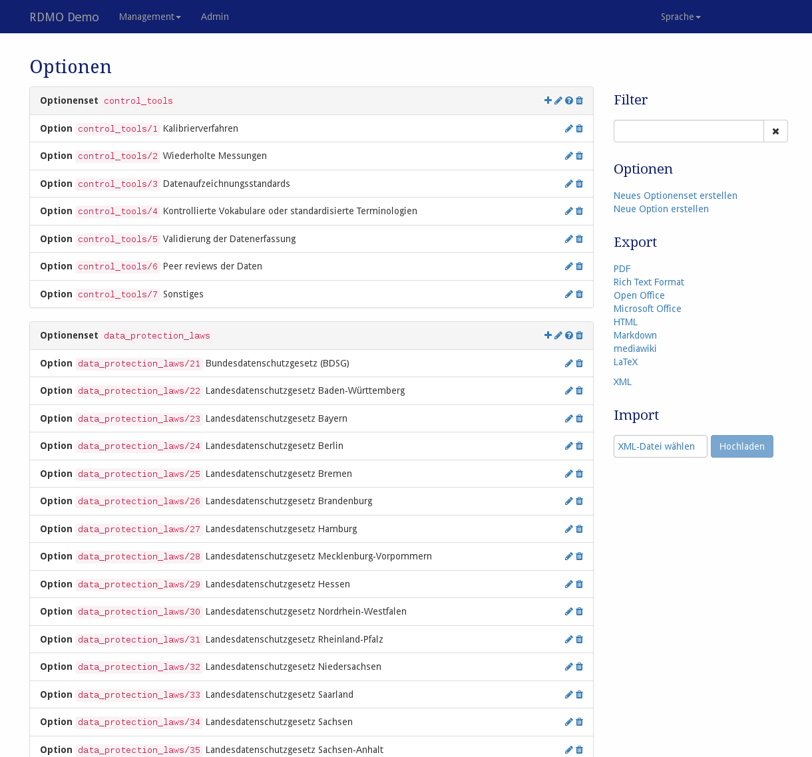

# Optionen

Optionen und Optionensets können unter *Optionen* im Managementmenü in der Navigationsleiste bearbeitet werden.

> *Screenshot des Optionenmanagement-Interfaces*

Auf der linken Seite sind alle Optionen und Optionsets der RDMO-Installation dargestellt. Optionensets zeigen ihren Schlüssel, während bei Optionen ihr Pfad und ihr Text dargestellt wird. Auf der rechten Seite von jedem Optionenfeld befinden sich Symbole zum Bearbeiten der Elemente. Folgende Optionen sind verfügbar:

* **Hinzufügen** () einer neuen Option oder eines Optionensets.
* **Bearbeiten** () der Eigenschaften einer Option oder eines Optionensets.
* **Bedingungen bearbeiten** () (eines Optionsets). Eine Frage, die mit einem Optionenset verknüpft ist, wird die Optionen des Sets im Fragekatalog nicht anzeigen, wenn die Bedingung negativ evaluiert wird. Die Bedingungen selbst sind im [Bedingungsmangement](../conditions.html) konfiguriert.
* **Löschen** () einer Option oder eines Optionensets und im Falle ines Optionensets all seiner Optionen. **Diese Aktion kann nicht rückgägnig gemacht werden!**

Die Sidebar auf der rechten Seite zeigt weitere Bedienelemente:

* **Filter** filtert die Ansicht anhand eines vom Benutzer eingegebenen Strings. Nur Elemente, die diese Zeichenkette in ihrem Pfad enthalten, werden gezeigt.
* **Options** hält weitere Operationen bereit:

   * Neues (leeres) Optionenset erstellen
   * Neue (leere) Option erstellen

* **Exports** exportiert die Optionensets in eines der angezeigten Formate. Während die Textformate hauptsächlich für die Darstellung sind, können XML-Exporte für den Transfer der Optionen zu einer anderen RDMO-Installation verwendet werden.

Optionensets und das Optionenmodel haben unterschiedliche Eigenschaften, um ihr Verhalten zu verändern. Wie in [der Einleitung](../index.html) erklärt, besitzen alle Elemente einen URI-Präfix, einen Schlüssel und einen internen Kommentar, die nur von den anderen Managers der RDMO-Installation gesehen werden können. Ferner können folgende Parameter verändert werden:

## Parameter

### Optionensets

|Name|Beschreibung|
|-|-|
|Reihenfolge|Bestimmt die Position des Optionensets in der Liste im Fragenkatalog (falls ein Attribut mehr als ein Optionenset besitzt)|

### Option

|Name|Beschreibung|
|-|-|
|Optionenset|Das Optionenset zu dem die Option gehört. Das Ändern  des Optionensets wird die Option zu einem anderen Optionenset transferieren|
|Reihenfolge|Bestimmt die Position der Option in der Optionenliste oder im Fragenkatalog|
|Text (en)|Der englische Text für die Option, der dem Benutzer angezeigt wird|
|Text (de)|Der deutsche Text, der dem Benutzer angezeigt wird|
|Zusätzliche Eingabe|Legt fest, ob eine weitere Eingabe für diese Option möglich ist. Im Falle einer Textbox wird ein Radio-Button oder eine Checkbox angezeigt. Für gewöhnlich wird es für die Option "Sonstige" genutzt.
