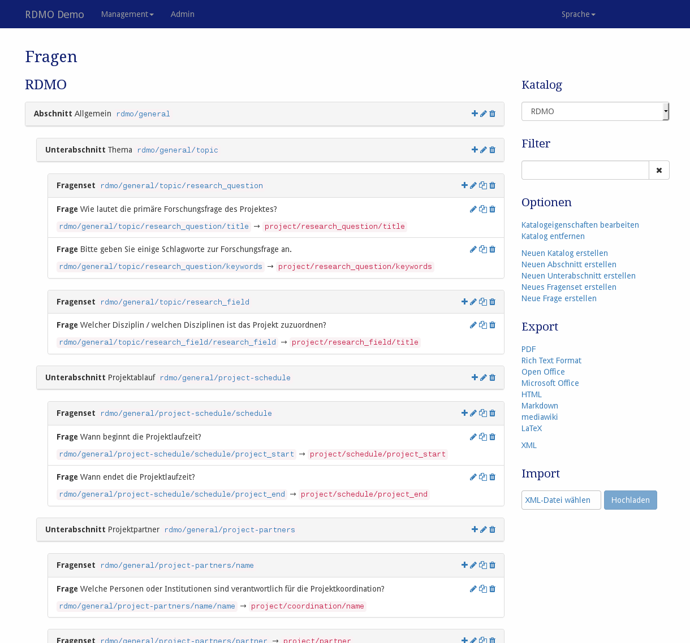

Fragen
------

Das Fragenmanagement ist unter *Fragen* im Managementmenü in der Navigationsleiste verfügbar. Direkt nach einer RDMO-Instalation ist dieser Bereich zunächst leer. Wir empfehlen **zuerst erst unser Domänenmodell** und ggf. auch unseren generischen Fragenkatalog zu importieren. Die entsprechenden XML-Dateien finden Sie unter https://github.com/rdmorganiser/rdmo-catalog.

Falls bereits mindestens ein Fragenkatalog vorhanden ist, so wird dieser automatisch angezeigt. Weitere Kataloge können in der Seitenleiste darunter ausgewählt werden.

   Screenshot des Fragenmangements-Interfaces.

Auf der linken Seite werden die Abschnitte, Fragensets und Fragen des aktuellen Katalogs angezeigt. Für Abschnitte und Fragensets wird der Titel und Schlüssel angezeigt. Für Fragen und Fragensets wird der Schlüssel und der Schlüssel des verknüpften Attributes angezeigt. Die Reihenfolge der verschiedenen Elemente ist die Gleiche wie im strukturierten Interview, welches den Nutzenden angezeigt wird. Auf der rechten Seite eines jeden Elementfeldes zeigen Symbole die Interaktionsmöglichkeiten an. Folgende Optionen sind verfügbar:

* **Hinzufügen** (|add|) eines neuen Abschnittes, eines Fragensets oder einer Frage.
* **Bearbeiten** (|update|) eines Elements, um seine Eigenschaften zu ändern.
* **Kopieren** (|copy|) einer Frage oder eines Fragekatalogs. Dies wird das gleiche Fenster öffnen wie das Bearbeiten. Es können einige der Eigenschaften verändert werden und das Element wird als ein neues Element gespeichert. Dies kann Zeit sparen wenn mehrere ähnliche Fragen erstellt werden.
* **Löschen** (|delete|) eines Elements und all seiner Abkömmlinge (z.B. Fragensets und all dessen Fragen). **Diese Aktion kann nicht rückgängig gemacht werden!**

.. |add| image:: ../_static/img/icons/add.png
.. |update| image:: ../_static/img/icons/update.png
.. |copy| image:: ../_static/img/icons/copy.png
.. |delete| image:: ../_static/img/icons/delete.png

Der Sidebar rechts enthält weitere Bedienelemente:

* **Katalog** wechselt zu der Ansicht eines anderen Katalogs.
* **Filter** filtert die Ansicht anhand eines vom Benutzer eingegebenen Strings. Nur Elemente, die diese Zeichenkette in ihrem Pfad enthalten, werden gezeigt.
* **Optionen** enthält weitere Operationen:

  * Katalogeigenschaften bearbeiten
  * Katalog entfernen
  * Neuen Katalog erstellen
  * Neuen Abschnitt erstellen
  * Neuen Frageset erstellen
  * Neue Frage erstellen

* **Export** exportiert den aktuellen Katalog in eines der angebotenen Formate. Während Textformate hauptächlich für Präsentationszwecke sind, können XML-Exporte für den Transfer des Kataloges zu einer anderen RDMO-Installation verwendet werden.

Die verschiedenen Elemente des Fragebogens haben verschiedenen Eigenschaften, um ihr Verhalten zu beschreiben. Wie in :doc:`der Einleitung <index>` erwähnt, haben alle Elemente einen URI-Präfix, einen Schlüssel und einen internen Kommentar, die nur dem Manager der RDMO-Installation zugänglich sind. Außerdem können folgende Parameter geändert werden:

Katalog
"""""""

Reihenfolge
  Bestimmt die Reihenfolge des Katalogs in der Liste oder der Interview-Ansicht.

Titel (en)
  Der englische Titel für den Katalog, der dem Benutzer angezeigt wird.

Titel (de)
  Der deutsche Titel für den Katalog, der dem Nutzer angezeigt wird.

Abschnitt
"""""""""

Katalog
  Der Katalog zu dem der Abschnitt gehört. Ändern des Katalogs wird den Abschnitt zu einem anderen Katalog verschieben. Daher wird er dann nicht mehr in der aktuellen Ansicht sichtbar sein.

Reihenfolge
  Bestimmt die Reihenfolge des Abschnittes in der Liste oder der Interview-Ansicht.

Titel (en)
  Der englische Titel des Abschnittes, der dem Benutzer angezeigt wird.

Titel (de)
  Der deutsche Titel des Abschnittes, der dem Benutzer angezeigt wird.

Fragenset
"""""""""

Tab Allgemein
  Abschnitt
    Der Abschnitt zu dem das Frageset gehört. Ändern des Abschnitt verschiebt die Frage zu einem anderen Abschnitt.

  Reihenfolge
    Bestimmt die Position des Fragesets in der Liste oder der Interview-Ansicht.

  Attribut
    Das Attribut mit dem Fragenset verknüpfte Attribut. Wird nur benötigt wenn **Ist eine Sammlung** aktiviert ist.

  Ist eine Sammlung
    Legt fest ob jede Frage im Fragenset jewails für verschiedene Sets (z.B. Datensätze oder Projektpartner) beantwortet werden kann.

Tab Englisch
  Titel (en)
    Der englische Titel des Fragensets, der dem Benutzer angezeigt wird.

  Hilfe (en)
    Der englische Hilfetext des Fragensets

  Name
    Der englische Name der für die Sets verwendet wird, wenn **Ist eine Sammlung** aktiviert ist (z.B. dataset)

  Plural name
    Der englische Name im Plural der für die Sets verwendet wird, wenn **Ist eine Sammlung** aktiviert ist (z.B. datasets)

*Der Tab "Deutsch" enthält die gleichen Informationen wie der der englischen Sprache. Offenkundig jedoch in Übersetzung.*

Tab Bedingungen
    Bedingungen
        Zeigt die mit dem Fragenset verknüpften Bedingungen an. Wenn **alle** der ausgewählten Bedingungen negativ evaluiert werden, wird das Frageset im Interview übersprungen.

Fragen
""""""

Tab Allgemein
  Fragenset
    Das Fragenset zu dem die Frage gehört. Ändern des Fragensets verschiebt die Frage zu einem anderen Fragenset.

  Reihenfolge
    Bestimmt die Position des Fragensets in der Liste oder der Interview-Ansicht.

  Attribut
    Das Attribut des Domänenmodels dem die Frage zugeordnet ist. Die Antworten der Nutzenden werden in der Datenbank diesem Attribut zugeordnet und in Aufgaben oder Ansichten werden diese Antworten über das Attribut referenziert.

  Ist eine Sammlung
    Legt für die Frage mehrere Antworten eingegem werden können. In diesem Fall werden zusätzliche Elemente im Interview angezeigt um Antworten hinzuzufügen bzw. zu entfernen.

  Widget-Typ
    Die Art des Widgets für die Frage.  Folgende Widgets können gewählt werden:

    * **Text** (Ein Einzeiler-Textfeld)
    * **Textarea** (Ein Mehrzeiler-Textfeld)
    * **Yes/No** (Ein Set aus Radio Buttons für "Ja" und "Nein")
    * **Checkboxes** (Ein Set aus Checkboxen, das verknüpfte Attribut muss eine Kollektion sein)
    * **Radio Buttons** (Ein Set aus Radio buttons, das verknüpfte Attribut muss ein Optionenset sein)
    * **Select drop down** (Ein Dropdown-Menu, das verknüpfte Attribut muss ein Optionenset haben)
    * **Range slider** (Ein horizontaler Schieber, das verknüpfte Attribut muss einen Wertebereich haben)
    * **Date picker** (Ein Dropdown-Element mit einem Kalender, um ein Datum zu wählen. Das verknüpfte Attribut muss vom Datentyp Datetime sein)

  Wert-Typ
    Die Art von Wert, der für diese Frage eingegeben werden kann. Zur Auswahl stehen:
    Text, URL, Ganzzahl, Kommazahl, Boolsche Variable, Datum und Zeit, Option

  Einheit
    Die Maßeinheit für diese Frage

Tab Englisch
  Text
    Der englische Text für die Frage. Der Text wird in fett gedruckt dem Benutzer angezeigt.

  Hilfe
    Der englische Hilfetext für die Frage. Der Hilfetext wird dem Benutzer in grau angezeigt.

  Name
    Der englische Name der für die einzelnen Antworten verwendet wird, wenn **Ist eine Sammlung** aktiviert ist (z.B. item).

  Plural name
    Der englische Name im Plural der für die einzelnen Antworten verwendet wird, wenn **Ist eine Sammlung** aktiviert ist (z.B. items).

*Der Tab "Deutsch" enthält die gleichen Informationen wie der der englischen Sprache. Offenkundig jedoch in Übersetzung.*

Tab Optionensets und Bedingungen
  Optionensets
    Zeigt die mit der Frage verknüpften Optionensets an. Für die **Widget-Typen** Checkboxes, Radio Buttons und Select drop down enthalten die Optionensets die möglichen Anwortoptionen.

  Bedingungen
    Zeigt die mit der Frage verknüpften Bedingungen an. Zur Zeit hat die Auswahl noch keinen Effekt, könnte aber in Zukunft verwendet werden.

Tab Bereich
  Minimum
    Minimaler Wert für den **Widget-Typ** Range-Slider.

  Maximum
    Minimaler Wert für den **Widget-Typ** Range-Slider.

  Schrittgröße
    Schrittgröße für den **Widget-Typ** Range-Slider.
