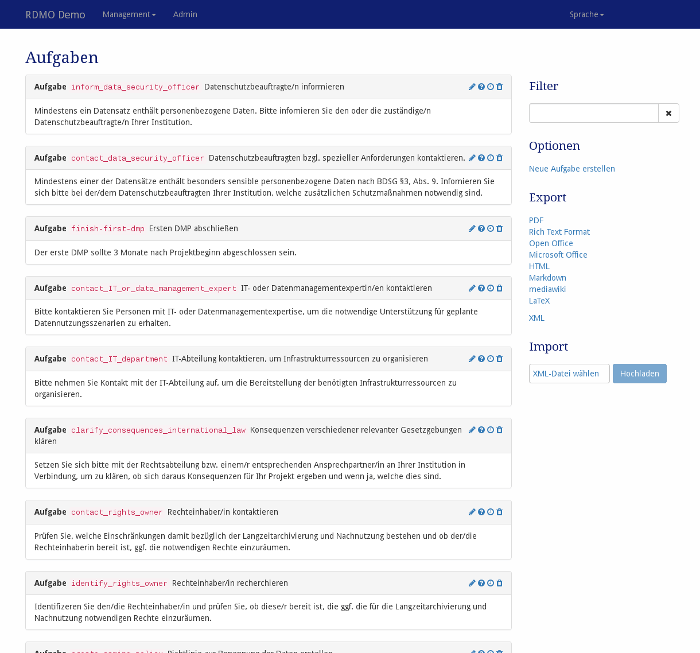

# Aufgaben

Aufgaben sind unter *Aufgaben* im Managementmenü in der Navigationsleiste konfigurierbar.

> *Screenshot der Aufgabenmangement-Seite*

Auf der linken Seite werden alle Aufgaben der RDMO-Installation mit Schlüssel, Titel und ihre Aufgabenbeschreibung angezeigt. Auf der rechten Seite des Aufgabenfeldes zeigen Symbole Interaktionsmöglichkeiten an. Folgende Optionen sind verfügbar:

* **Bearbeiten** () einer Aufgabe, um dessen Eigenschaften zu ändern.
* **Bedingung bearbeiten** () einer Aufgabe. eine Aufgabe wird dem Benutzer nur angezeigt, wenn all ihre Bedingungen als `true` ausgewertet werden. Die Bedingungen selbst sind unter [dem Bedingungsmanagement](../conditions.html) konfiguriert.
* **Zeitrahmen bearbeiten** () einer Aufgabe. Der Zeitrahmen wird erstellt aus Daten von den Antworten des Benutzers. Dies erlaubt es, Aufgaben mit einer bestimmten Deadline oder einer bestimmten Dauer festzulegen.
* **Entfernen** () einer Aufgabe. **Diese Aktion kann nicht rückgängig gemacht werden!**

Der Sidebar auf der rechten Seite enthält weitere Bedienelemente:

* **Filter** filtert die Ansicht anhand eines vom Benutzer eingegebenen Strings. Nur Elemente, die diese Zeichenkette in ihrem Pfad enthalten, werden gezeigt.
* **Optionen** bietet weitere Optionen:

* Neue Aufgabe erstellen

* **Export** exportiert in eines der angegebenen Formate. Während Textformate hauptsächlich für die Präsentation sind, können XML-Formate für den Transfer der Aufgabe zu einer anderen RDMO-Installation verwendet werden.

Aufgaben haben unterschiedliche Eigenschaften, um ihr Verhalten zu konfigurieren. Wie in [der Einleitung](index.html) beschrieben besitzen alle Elemente einen URI-Präfix, einen Schlüssel und einen internen Kommentar, die nur von den Managern der RDMO-Installation gesehen werden können. Ferner können folgende Parameter verändert werden:

## Parameter

### Aufgabe

|Name|Explanation|
|-|-|
|**Tab English**||
|Titel|Der englische Titel für die Aufgabe. Der Titel wird in der Projektübersicht angezeigt.|
|Text|Der englische Text für die Ansicht. Der Text wird in der Projektübersicht angezeigt.|
|**Tab Deutsch**|*enthält die gleichen Informationen wie der der englischen Sprache, jedoch in Übersetzung.*|
|**Tab Gruppen**|
|Gruppen|Zeigt die Gruppen für diese Aufgabe an. Wenn mindestens eine der Gruppen  ausgewählt ist, wird nur Nutzenden aus diesen Gruppen den Aufgabe in  einem Projekt angezeigt.|
|**Tab Sites**|
|Sites| *(Nur in einer Mult-Site-Installation)* Zeigt die Sites für diese Aufgabe an.  Nur Nutzende dieser Sites wird die Aufgabe in einem Projekt angezeigt.|

### Zeitrahmen

|Name|Beschreibung|
|-|-|
|Startdatum-Attribut|Das Startdatum-Attribut legt das Startdatum für die Aufgabe fest. Das Attribut benötigt einen Wertetyp *datetime*|
|Enddatum-Attribut|Das Enddatum-Attribut legt das Enddatum der Aufgabe fest (optional, falls kein Enddatum gegeben ist, setzt das Startdatum-Attribut auch das Enddatum-Attribut). Das Attribut braucht den Wertetyp *datetime*|
|Tage vorher|Vorrangehende Tage bis zum Starttermin|
|Tage danach|Anschließende Tage nach dem Enddatum|
