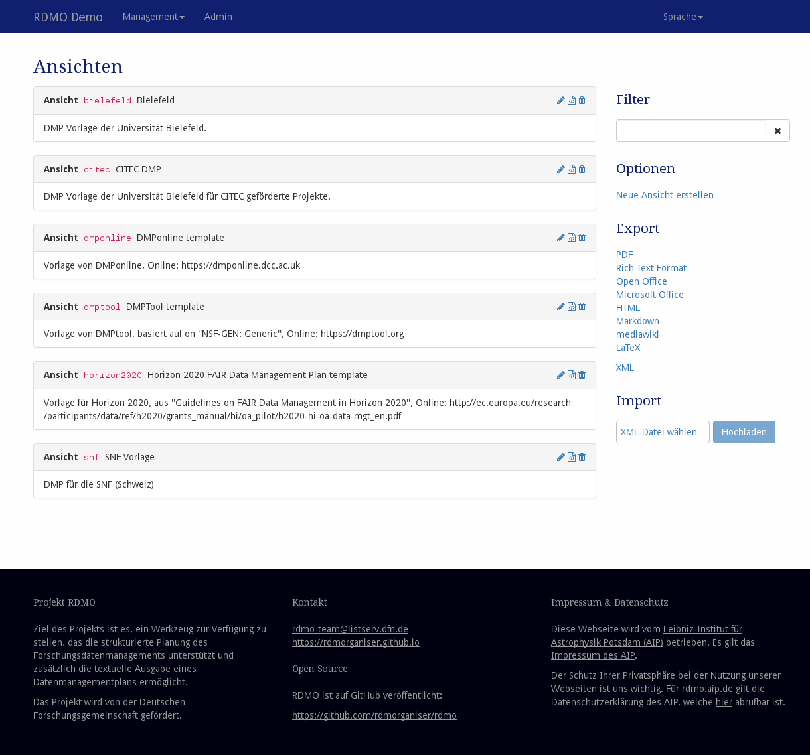
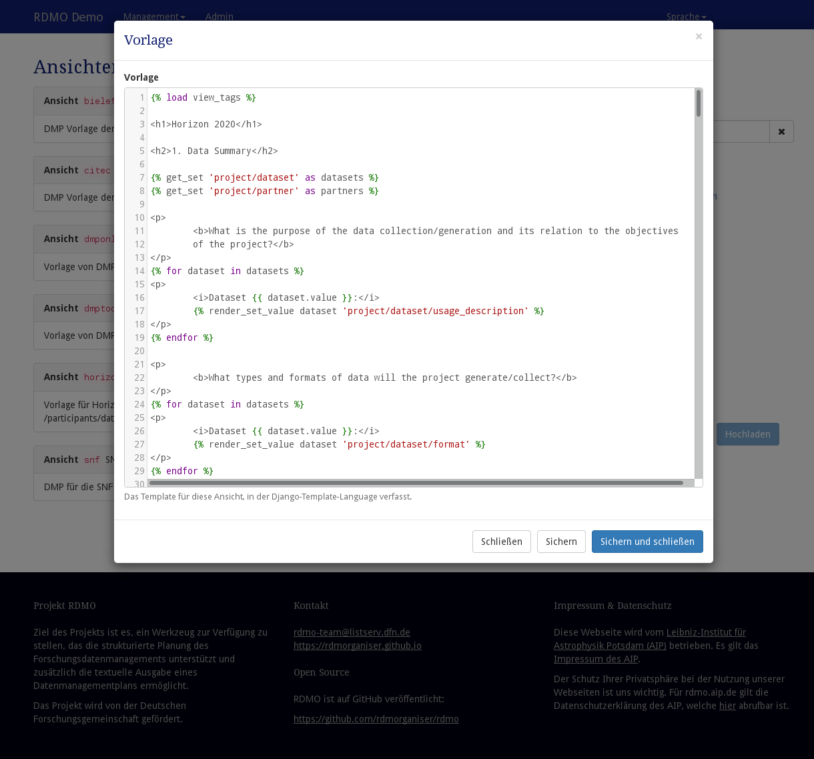

# Ansichten

Ansichten können unter *Ansichten* im Managementmenü in der Navigationsleiste konfiguriert werden.


> *Screenshot des Ansichtenmangement-Interfaces*

Auf der linken Seite werden alle Ansichten der RDMO-Installation angezeigt. Ansichten zeigen ihren Schlüssel, ihren Titel und eine Beschreibung. Auf der rechten Seite von jedem Ansichtenfeld zeigen Symbole die Interaktionsmöglichkeiten an. Folgende Optionen stehen zur Verfügung:

* **Bearbeiten** () einer Ansicht, um dessen Eigenschaften zu ändern.
* **Template bearbeiten** () einer Ansicht.
* **Entfernen** () einer Ansicht. **Diese Aktion kann nicht rückgängig gemacht werden!**

Die Sidebar auf der rechten Seite enthält weitere Bedienelemente:

* **Filter** filtert die Ansicht anhand eines vom Benutzer gegeben Strings. Nur Ansichten, die diesen String in ihrem Pfad haben, werden angezeigt.
* **Optionen** ermöglichen weitere Operationen:

  * Neue Ansicht erstellen

* **Export** exportiert die Ansichten zu eine der angegebenen Formate. Während Textformate hauptsächlich für die Präsentation sind, können XML-Ausgaben für den Transfer der Ansichten zu einer anderen RDMO-Installation verwendet werden.

Ansichten haben unterschiedliche Eigenschaften, die ihr Verhalten zu bestimmen. Wie in [der Einleitung](../index.html) beschrieben haben alle Elemente einen URI-Präfix, einen Schlüssel und einen internen Kommentar, die nur von den Managern der RDMO-Installation gesehen werden können. Ferner können folgende Parameter geändert werden:


## Parameter

### Ansicht

|Name|Beschreibung|
|-|-|
|Title (en)|Der englische Titel der Ansicht. Der Titel wird in der Projektübersicht angezeigt|
|Title (de)|Der deutsche Titel der Ansicht. Der Titel wird in der Projektübersicht angezeigt|
|Hilfe (en)|Der englische Hilfetext der Ansicht. Der Hilfetext wird in der Projektübersicht angezeigt|
|Hilfe (de)|Der deutsche Hilfetext der Ansicht. Der Hilfetext wird in der Projektübersicht angezeigt|


### Vorlage


> *Screenshot der Vorlagen-Ansicht*

Jede Ansicht hat eine Vorlage (Template), die bestimmt wie Fragen mitsamt ihrer Antworten in einem Textdokument dargestellt werden. Die Vorlage benutzt die [Django template](https://docs.djangoproject.com/en/1.11/ref/templates/language/) syntax, welche sich aus einer Kombination aus regulärem HTML, Variablen und Tags zusammensetzt. Variablen (`{{ a_variable }}`) werden bei der Vorlageauswertung durch ihre entsprechenden Werte ersetzt. Tags (``) kontrollieren die Logik der Vorlage.

In der ersten Zeile einer `Vorlage` befindet sich der Befehl, der dafür sorgt, dass die verfügbaren Tags geladen werden. Auf diese Weise können sie im vorliegenden Template genutzt werden.

```django

```

Unmittelbar danach befindet sich in der Regel die Variablen-Deklaration der genutzten Datensätze. Auf diese Weise können Platzhalter definiert werden, die im gesamten Template zu Verfügung stehen. Diese können beispielsweise für Schleifen genutzt werden, wie wir später sehen werden.

```django


```

Nehmen wir an es gäbe ein Attribut `project/research_question/title` und einen Benutzer, der die zum Attribut gehörige Frage mit: "Kühn dorthin gehen, wohin noch kein Mensch sich gewagt hat" beantwortet hat. Der Attributwert ist dann in der Vorlage als `values/project/fragestellung/title` abrufbar. In der Vorlage wird die Syntax für eine Variable verwendet:

```django
Die Fragestellung des Projekts ist: 
```

würde dann, wenn ausgewertet im Kontext beim Benutzer seines Projekts, ausgeben:

```django
Die Fragestellung des Projekts ist: "Kühn dorthin gehen, wohin noch kein Mensch sich gewagt hat".
```

Listen von mehreren Werten können auf diese Weise erzeugt werden.

```django
<p>
    
</p>
```

Als Äquivalent des oben genannten Beispiels kann das folgende genutzt werden. Der Vorteil besteht darin, dass das Layout der Liste mit diesem Snippet frei steuerbar ist.
```django
<ul>

    
        <li>{{ value.value }}</li>
    
</ul>
```

Für Sammlungsentitäten können eingangs erwähnten Platzhalter genutzt werden. Der Code sieht dann aus wie folgt:

```django

    <p>
        
    </p>

```

Ob Werte bestimmte Bedingungen erfüllen, kann ebenfalls ausgewertet werden. Wenn Sie beispielsweise etwas anzeigen möchten, nur dann wenn ein bestimmter Wert **true** ist, können sie das auf folgende Weise tun. Beachten Sie, dass analog zu **.is_true** auch eine genau so funktionierende **.is_false** Funktion existiert.

```django


    This will be only rendered if personal_data resolves to be true.

```

Bitte lesen Sie die Dokumentation von Django template syntax für alle verfügbaren Tags und Filter: <https://docs.djangoproject.com/en/1.11/ref/templates/language>.
