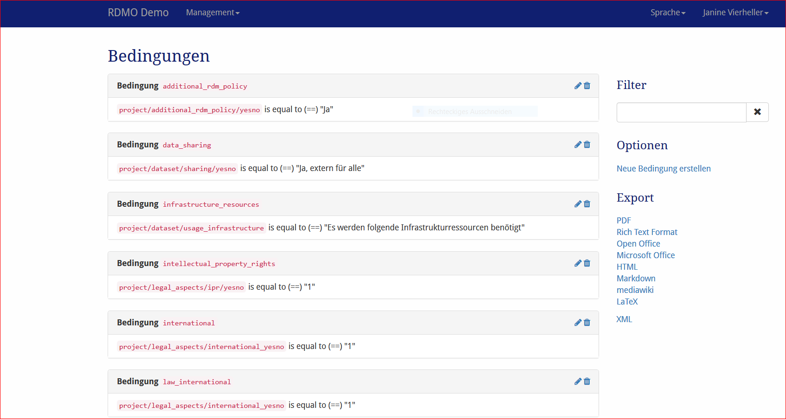

BEdingungen
----------

Bedingungen können erstellt und bearbeitet werden unter *Bedinungen* im Mangamentmenü der Navigationsleiste. Später werden sie mit Entitäten, Attributen, Optionensets oder Aufgaben verbunden.

   Screenshot des Bedinungen-Managment Interfaces.
   
  Auf der linken Seite sind alle Bedingungen der RDMO-Instalaltion verfügbar. Bedinungen zeigen ihren Schlüssel und eine textuelle Darstellung was sie auswerten. Auf der rechten Seite von jedem Bedinungsfeld zeigen Symbole an wie mit dem jewieligen Element interagiert werden kann. Die folgenden Optionen stehen zur Auswahl:

* **Bearbeiten** (|update|) der Eigenschaften einer Bedingung.
* **Löschen** (|delete|) einer BEdingung. **Diese Handlung kann nicht rückgängig gemacht werden!**

.. |update| image:: ../_static/img/icons/update.png
.. |delete| image:: ../_static/img/icons/delete.png

In der rechten Sidebar gibt es weitere Interface-Optionen:

**Filter** erlaubt eine Ansicht entsprechend eines vom Benutzer gegeben Strings. Nur Bedingungen, die diesen String enthalten, werden angezeigt.
**Optionen** bietet weitere Optionen:

  * Neue Bedingung erstellen
  
  * **Export** exportiert die Bedigungen in eins der angezeigten Formate. Während die Textformate hauptschächlich für die Darstellung sind, können XML Ausgaben für den Transfer von Bedingungen zu anderen RDMO Installationen genutzt werden.

Bedingungen haben unterschiedliche Eigenschaften, um ihr Verhalten zu kontrollieren. Wie in :doc:`in der Einleitung <index>` beschrieben,  haben alle Elemente einen URI-Präfix, einen Schlüssel und einen internen Kommentar, die nur von den anderen Managern der RDMo Installation gesehen werden können. Ferner können folgende Parameter verändert werden: 

Bedingung
"""""""""

Bedingungen sind mit einem Quellen-Attribut, der ausgewertet wird, einer Beziehung wie "gleich" oder "größer als" und einem Ziel ausgestattet. Beispielsweise, wenn eine Quelle das Attribut ``project\legal_aspects/ipr/yesno`` ist, die Beziehung "gleich" und das Ziel "1" ist, dann wird die Bedingung für ein Projekt als wahr ausgewertet werden, wenn die Antwort zu der Frage verbunden mit dem Attribut ``project/legal_aspects/ipr/yesno`` "1" ist (oder "ja" für einen Ja-Nein Widget).

Quelle
  Das Attribut der Bedingung wird ausgewertet.

Beziehung
  Die Beziehung dieser Kondition, die verwendet wird.

Ziel (Text)
  Fals eine reguläres Attribut verwendet wird, wird der Textwert dieses Attributs gegengeprüft.

Ziel (Option)
  Falls ein Optionsattribut verwendet wird, wird die Option der Bedingung gegengeprüft.
