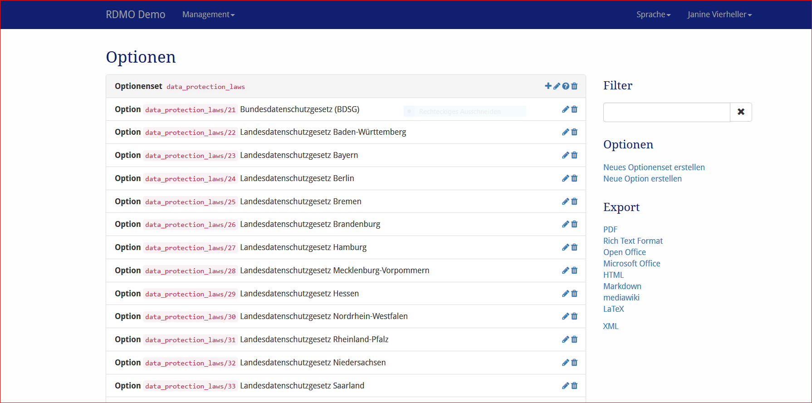

Optionen
-------

Optionen und Optionensets können unter *Optionen* im Managementmenü inder Navigationsleiste bearbeitet werden.

   
   Screenshot des Optionenmanagement-Interfaces.

Auf der linken Seite sind alle Optionen und Optionsets der RDMO-Installation dargestellt. Optionensets zeigen ihren Schlüssel, während Optionen ihren Pfad und ihen Text zeigen. Auf der rechten Seite von jedem Optionenfeld befinden sich Symbole zum Interagieren mit den Elementen. Folgende OPtionen sind verfügbar:

* **Hinzufügen** (|add|) einer neuen Option oder eines Optionensets.
* **Bearbeiten** (|update|) der Eigenschaften einer Option oder eines Optionensets.
* **Bedingungen bearbeiten** (|conditions|) eines Optionsets. Eine Frage, di emit einem Attribut verknüpft ist, die wiederum selbst mit einem Optionenset verknüpft ist, wird die Optionen des Sets im Fragekatalog nicht anzeigen, wenn die Bedingung als falsch ausgerwertet wird. Die Bedingungen selbst sind im :doc:`Bedingungsmangement <conditions>` konfiguriert.
* **Löschen** (|delete|) einer Option oder eines Optionensets und im Falle ines Optionensets all seiner Optionen. **Diese Handlung kann nicht rückgägnig gemacht werden!** 

.. |add| image:: ../_static/img/icons/add.png
.. |update| image:: ../_static/img/icons/update.png
.. |conditions| image:: ../_static/img/icons/conditions.png
.. |delete| image:: ../_static/img/icons/delete.png

Die Sidebar auf der rechten Seite zeigt weitere Interface-Objekte:

* **Filter** erlaubt eine Ansicht abhängig von einem vom Benutzer gegeben Strings. Nur Elemente, die diesen String in ihrem Pfad enthalten, werden angezeigt.
* **Options** hält weitere Operationen bereit:

   * Neues (leeres) Optionenset erstellen
   * Neue (leere) Option erstellen

* **Exports** exportiert die Optionensets in eins der angezeigten Formate. Während die Textformate hautpsächlich für die Darstellung sind, können XML-Exporte für den Transfer der Optionen zu einer anderen RDMO-Installtion verwendet werden.

Optionensets und das Optionenmodel haben unterschiedliche Eigenschaften, um ihr Verhalten zu verändern. Wie in :doc:`der Einleitung <index>` erklärt, besitzen alle Elemente einen URI-Präfix, einen Schlüssel und einen internen Kommentar, die nur von den anderen Managers der RDMO-Installation gesehen werden können. Ferner können folgende Parameter verändert werden:

.. figure:: ../_static/img/screens/Bearbeiten.PNG
   :target: ../_static/img/screens/Bearbeiten.PNG
   
   Screenshot des Interfaces für die Parameter.

Optionensets
""""""""""

Reihenfolge
  Bestimmt die Postion des Optionensets in der Liste im Fragenkatalog (falls ein Attribut mehr als ein Optionenset besitzt).

Option
""""""

Optionenset
  Das Optionenset zu dem die Option gehört. Das Ändern des Optionensets wird die Option zu einem anderen Optionenset transferieren.

Reihenfolge
  Bestimmt die Position der Option in der Liste oder in dem Fragenkatalog.

Text (en)
  Der englische Text für die Option, der dem Benutzer angezeigt wird.

Text (de)
  Der deutsche Text, der dem Benutzer angezigt wird.
  
Zusätzliche Eingabe
  Legt fest, on eine weitere Eingabe für diese Option möglich ist. Im Falle einer Textbox wird ein Dario button oder eine Checkbox angezeigt. Für gewöhnlich wird es für die Option "Sonstige" genutzt.
