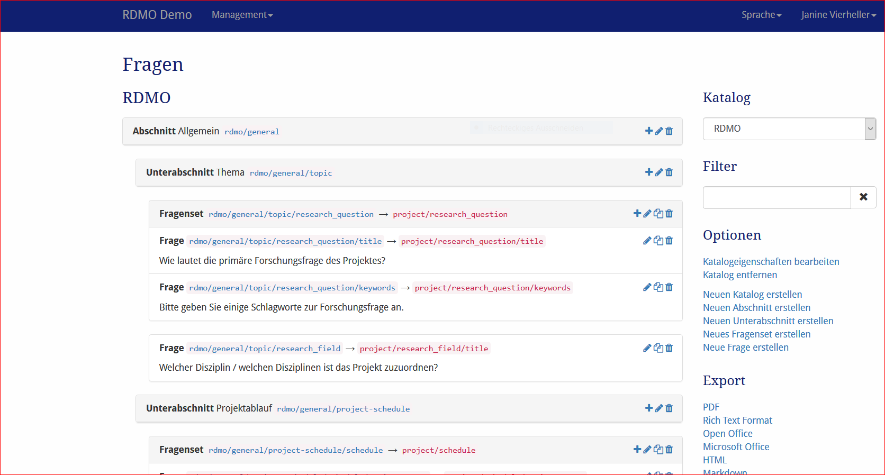
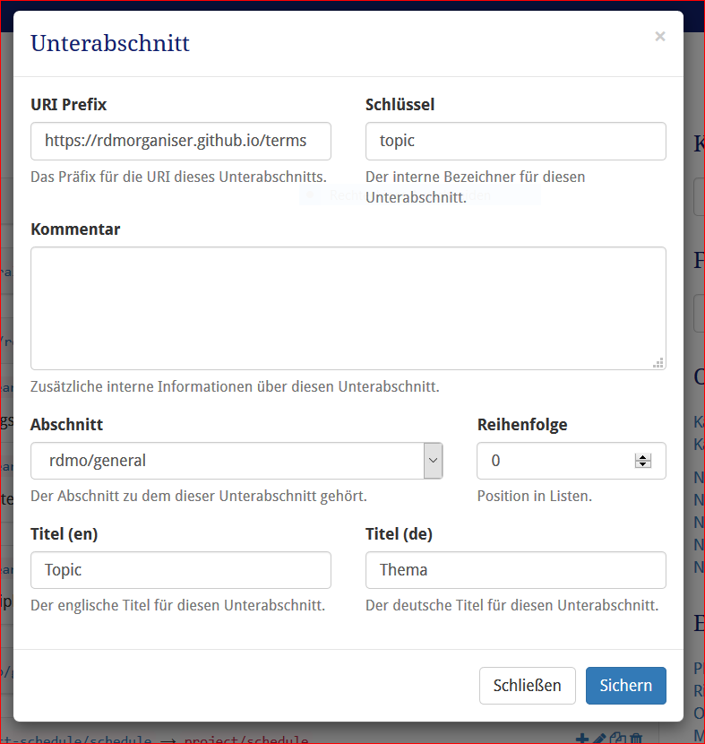

Fragen
---------

Das Fragenmangament ist unter *Fragen* in dem Mangamentmenü in der Navigationsleiste verfügbar. De Link in der Navigationsleiste öffnet den ersten Katalog. Weitere Kataloge können in der Sidebar darunter ausgewählt werden.

The questions management is available under *Questions* in the management menu in the navigation bar. The link in the navbar opens the first catalog. Other catalogs can be selected in the sidebar afterwards.

   
   Screenshot des Fragenmangements-Interfaces.

Auf der linken Seite werden die Abschnitte, Teilabschnitte und Fragen des aktuellen Katalogs angezeigt. Für Abshcnitte und Teilabschnitte wird der Titel und Schlüssel angezeigt. Für Fragen und Fragensets wird der Schlüssel und der Schlüssel des verknüpften Attributes oder Entität angezeigt. Die Reihenfolge der verschiedenen Elemente ist die Gleiche wie im struktiriertem Interview, welches dem Benutzer angezeigt wird. Auf der rechten Seite eines jeden Elementfeldes zeigen Symbolde die Interaktionsmöglichkeiten an. Folgende Optionen sind verfügbar:

* **Hinzufügen** (|add|) eines neuen Abschnittes, einer neuen Frage oder eines Fragensets zu einem Teilabschnitt oder eine neue Frage zu einem Frgenset.
* **Bearbeiten** (|update|) eines Elements, um seine Eigenschaften zu ändern. 
* **Kopieren** (|copy|) einer Frage oder eines Fragekatalogs. Dies wird das gleiche Fenster öffnen wir beim Bearbeiten. Es können einige der Eigenschaften verändert werden und das Element wird als ein neues Element gespeichert. Dies kann Zeit sparen wenn mehrere ähnliche Fragen erstellt werden.
* **Löschen** (|delete|) eines Elements und all seiner Abkömmlinge (z.B. Unterabschnitte und all dessen Fragen und Fragensets). **Diese Handlung kann nicht rückgängig gemacht werden!** 

.. |add| image:: ../_static/img/icons/add.png
.. |update| image:: ../_static/img/icons/update.png
.. |copy| image:: ../_static/img/icons/copy.png
.. |delete| image:: ../_static/img/icons/delete.png

Die Sidebar rechts enthält weitere Interface-Objekte:

* **Katalog** wechselt zu der Ansicht eines anderen Katalogs.
* **Filter** filtert eine Anssicht anhand eines vom Benutzer eingegeben Strings. Alle Elemente, die diesen String in ihrem Pfad enthalten,w erden angezeigt.
* **Optionen** enthält weitere Operationen:

  * Katalogeigenschaften bearbeiten
  * Katalog entfernen
  * Neuen Katalog erstellen
  * Neuen Abschnitt erstellen
  * Neuen Unterabschnitt erstellen
  * Neuen Frageset erstellen
  * Neue Frage erstellen

* **Export** exportiert den aktuellen Katalog zu einem der angegeben Formate. Während Textformate hauptächlich für Präsentationszwecke sind, können XML-Exporte für den Transfer des Kataloges zu einer anderen RDMO-Installation verwendet werden.

Die verschiedenen Elemente des Fragebogens haben verschiedenen Eigenschaften, um ihr Verhalten zu beschreiben. Wie in :doc:`der Einleitung <index>` beschrieben, haben alle Elemente einen URI-Präfix, einen Schlüssel und einen internen Komemntar,all elements have an URI Prefix, a key, and an internal comment only to be seen by other managers of the RDMO installation. In addition, you can edit the parameters below:

   
   Screenshot des Fensters, um die Parameter eines elements zu bearbeiten.
   
Katalog
"""""""

Reihenfolge
  Bestimmt die Reihenfolge des Katalogs in der Liste oder des Interviews.

Titel (en)
  Der englische Titel für den Katalog, der dem Benutzer angezeigt wird.

Titel (de)
  Der deutsche Titel für den Katalog, der dem Nutzer angezeigt wird.

Abschnitt
"""""""

Katalog
  Der Katalog zu dem der Abschnitt gehört. Ändern des Katalogs wird den Abschnitt zu einem anderen Katalog verschieben. Daher wird er dann nicht mehr in der aktuellen Ansicht sichtbar sein.

Reihenfolge
  Bestimmt die Reihenfolge des Abschnittes in der Liste oder in dem Interview.

Titel (en)
  Der englische Titel des Abschnittes, der dem Benutzer angezeigt wird.

Titel (de)
  Der deutsche Titel des Abschnittes, der dem Benutzer angezeigt wird.

Teilabschnitt
""""""""""

Katalog
  Der Katalog zu dem der Teilabschnitt gehört. Ändern des Katalogs wird den Teilabschnitt zu einem anderen Katalog verschieben. Daher wird er dann nicht mehr in der aktuellen Ansicht sichtbar sein.

Reihenfolge
  Bestimmt die Reihenfolge des Teilabschnittes in der Liste oder in dem Interview.

Titel (en)
  Der englische Titel des Teilabschnittes, der dem Benutzer angezeigt wird.

Titel (de)
  Der deutsche Titel des Teilabschnittes, der dem Benutzer angezeigt wird.

Fragenset
"""""""""""""

Teilabschnitt
  Der Teilabschnitt zu dem das Frageset gehört. Ändern des Teilabschnittes verschiebt die Frage zu einem anderen Abschnitt.

Reihenfolge
  Bestimmt die Position des Fragesets in der Liste oder im Interview.

Entität
  Die Entität vom Dömänenmodel mit dem das Fragenset verknüft ist. Beachte, dass die Art wie das Fragenset dem Benutzer gezeigt wird teilweise bei der Entität festgelegt ist. Eine Frage, die mit einer Kollektionsentität verknüpft ist, erlaubt Antworten für verschiedene Sets.
  
Titel (en)
  Der englische Titel des Teilabschnittes, der dem Benutzer angezeigt wird.

Titel (de)
  Der deutsche Titel des Teilabschnittes, der dem Benutzer angezeigt wird.

Fragen
"""""""""

Teilabschnitt
  Der Unterabschnitt zu dem die Frage gehört. Ändern des Teilabschnittes verschiebt die Frage zu einem anderen Abschnitt.

Elter
  Das Fragenset zu demd ie Frage gehört. Dies sollte "- - - " für eine Frage sein, die direkt zu einem Teilabschnitt hinzugefügt wird und nicht zu einem Fragenset.

Reihenfolge
  Bestimmt die Position des Teilabschnittes in der Liste oder in dem Interview.

Attribute
  Das Attribut von dem Domainmodel zu dem die Frage zugeordnet ist. Beachte, dass die Art wir die Frage dem Benutzer angezeigt wird teilweise von der Entität festgelegt wird. Eine Frage, die mit einer Kollektiventität verknüpft ist, erlaubt mehrere Antworten und zeigt ein "Hinzufügen"-Symbol..

Widget type
  Die Art des Widgets für die Frage.  Folgende Widgets können gewählt werden:

  * **Text** (Ein Einzeiler-Textfeld)
  * **Textarea** (Ein Mehrzeiler-Textfeld)
  * **Yes/No** (Ein Set aus Radio Buttons für "Ja" und "Nein")
  * **Checkboxes** (Ein Set aus Check boxes, das verknüpfte Attribut muss eine Kollektion sein)
  * **Radio Buttons** (Ein Set aus Radio buttons, das verknüpfte Attribut muss ein Optionenset sein)
  * **Select drop down** (Ein Drop down menu, das verknüpfte Attribut muss ein Optionenset haben) 
  * **Range slider** (Ein horizontaler Schieber, das verknüpfte Attribut muss einen Wertebereich haben) 
  * **Date picker** (Ein Drop down element mit einem Kalender, um ein Datum zu wählen. Das verknüpfte Attribut muss vom Datentyp Datetime sein)

Text (en)
  Der englische Text für die Frage. Fer Text wird in fett gedruckt dem Benutzer angezeigt.

Title (de)
  Der deutsche Text für die Frage. Fer Text wird in fett gedruckt dem Benutzer angezeigt.

Hilfe (en)
  Der englische Hilfetext für die Frage. Der Hilfetext wird dem Benutzer in grau angezeigt.

Help (de)
  Der deutsche Hilfetext für die Frage. Der Hilfetext wird dem Benutzer in grau angezeigt.
